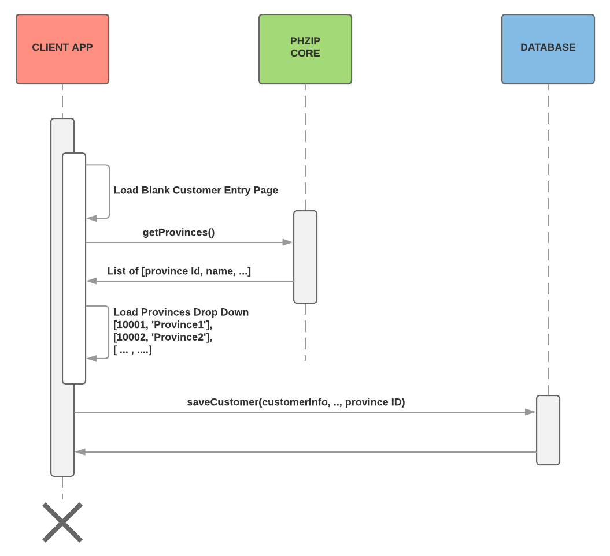
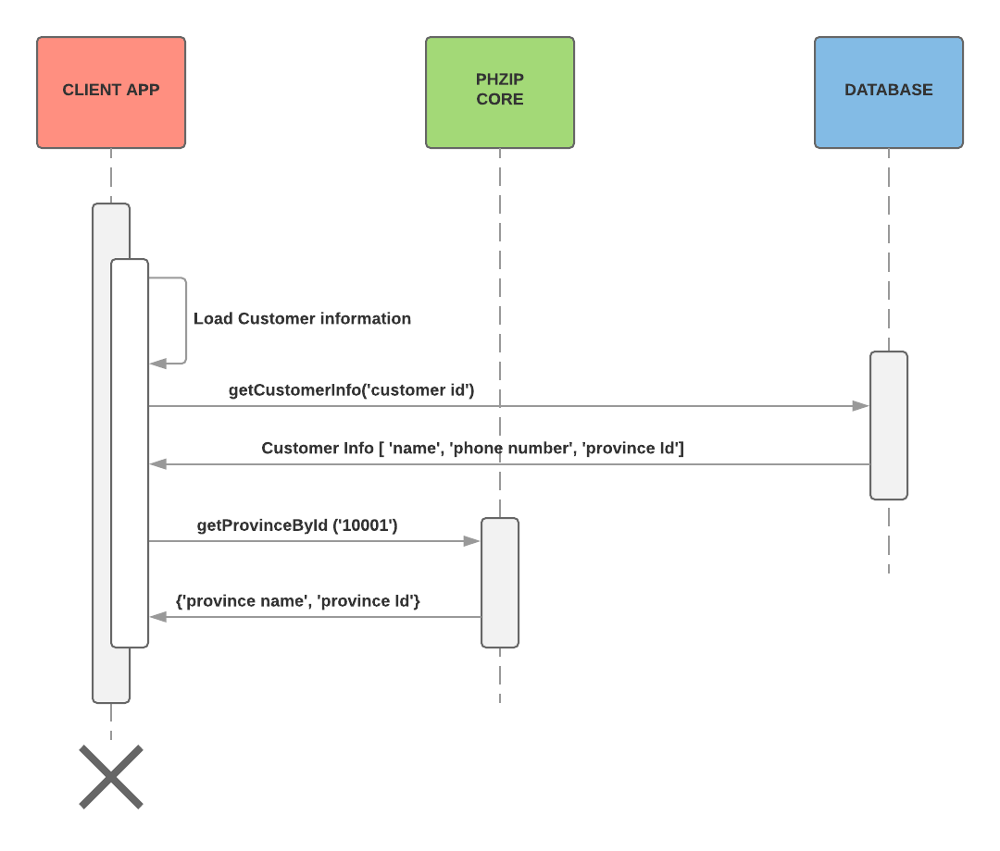

This project is a sub-component of [phzipweb](https://github.com/dhilario/phzipweb) i.e. a public REST API that supplies data for states, provinces, cities and zip codes. Current version only supports US and Philippine data. Future release will also include full-text search.

As an individual component it can already be used by applications to populate drop down of states, provinces, counties, cities, phone area codes, and zip codes without relying on the database. 

This component contains [JSON files](https://github.com/dhilario/phzip/tree/master/phzip-core/src/main/resources) with hierarchical representation of featured country, provinces and cities. As such, the only dependency it has is [gson](https://github.com/google/gson) that is used to deserialize JSON data file to serve clients.

Supports JDK 1.8 or higher.

# Get it

```
<dependencies>
  ...
   <!-- To use core API -->
	<dependency>
		<groupId>io.dhilar.phzip</groupId>
		<artifactId>phzip-core</artifactId>
		<version>0.2.0</version>
	</dependency>
	<!-- To use search API -->
	<dependency>
		<groupId>io.dhilar.phzip</groupId>
		<artifactId>phzip-search</artifactId>
		<version>0.2.0</version>
	</dependency>
	<!-- To use console app -->
	<dependency>
		<groupId>io.dhilar.phzip</groupId>
		<artifactId>phzip-console</artifactId>
		<version>0.2.0</version>
	</dependency>
  ...
</dependencies>
```

# Non-Maven

Download jars at [Central Maven repository](http://repo1.maven.org/maven2/io/dhilar/phzip/). Choose fat jar if you don't want to download individual dependencies.

# Usage

Sample use case of loading data from PhZip to populate drop-down of provinces, states, counties, cities, zip codes, etc. in order to eliminate the tasks of creating your own lookup tables data and internal APIs of these known fix values.



Retrieval of customer information and loading of province data using province Id.



# Documentation
* [Project Information](https://dhilar.io/phzip/docs/1.0/index.html)
* [PhZip Core Javadoc](https://dhilar.io/phzip/docs/0.2.0/phzip-core/apidocs/index.html)
* [PhZip Search Javadoc](https://dhilar.io/phzip/docs/0.2.0/phzip-search/apidocs/index.html)
* [PhZip Core Release Notes](https://dhilar.io/phzip/docs/0.2.0/phzip-core/releasenotes.html)
* [PhZip Search Release Notes](https://dhilar.io/phzip/docs/0.2.0/phzip-search/releasenotes.html)

## Examples
* [PhZip Core Examples](https://dhilar.io/phzip/docs/0.2.0/phzip-core/examples.html)
* [PhZip Search Examples](https://dhilar.io/phzip/docs/0.2.0/phzip-search/examples.html)
* [PhZip Console Examples](https://dhilar.io/phzip/docs/0.2.0/phzip-console/examples.html)