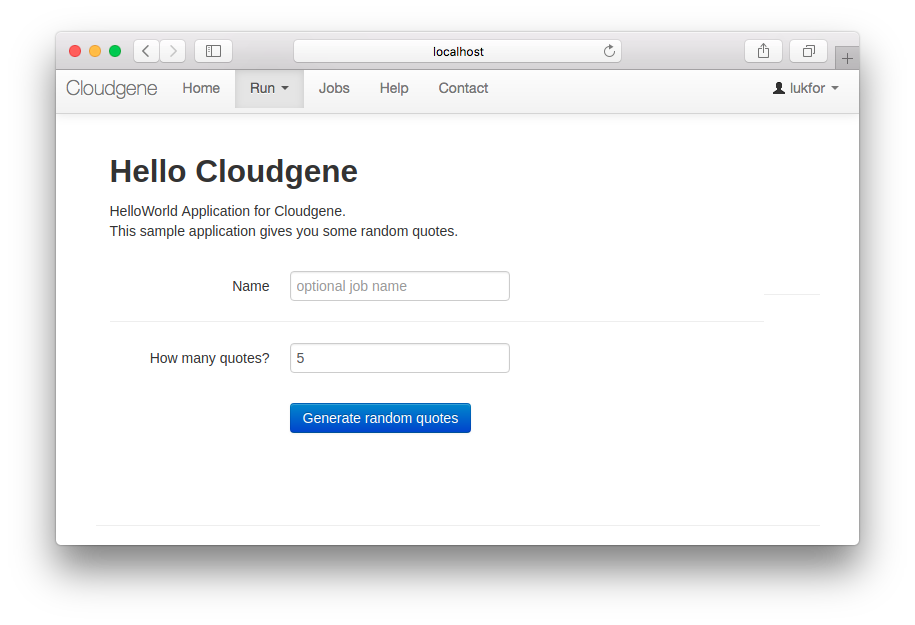
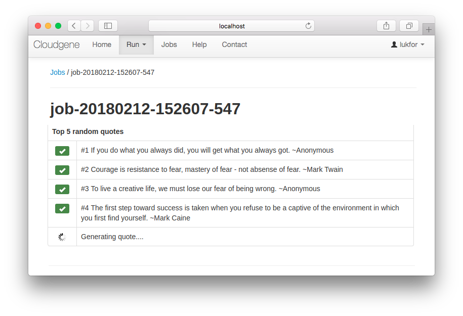

# Welcome to Cloudgene's documentation!

A framework to build Software As A Service (SaaS) platforms for data analysis pipelines.

## Requirements

You will need the following things properly installed on your computer.

* [Java 8 or higher](http://www.oracle.com/technetwork/java/javase/downloads/jdk8-downloads-2133151.html)
* [Hadoop](http://hadoop.apache.org/) (Optional)
* [Docker](https://www.docker.com/) (Optional)
* MySQL Server (Optional)


## Installation

You can install Cloudgene via our install script:

```sh
mkdir cloudgene
cd cloudgene
curl -s install.cloudgene.io | bash
```

Test the installation with the following command:

```sh
./cloudgene version
```

We provide a [Docker image](https://github.com/genepi/cloudgene-docker) to get a full-working Cloudgene instance in minutes without any installation.


## Getting started

The *hello-cloudgene* application can be installed by using the following command:

```sh
./cloudgene github-install lukfor/hello-cloudgene
```

The webserver can be started with the following command:

```sh
./cloudgene server
```

The webservice is available on http://localhost:8082. Please open this address in your web browser and enter as username `admin` and as password `admin1978` to login.

Click on *Run* to start the application.




A job can be started by filling out the form and clicking on the blue submit button. The *hello-cloudgene* application displays several inspiring quotes:




More examples can be found in [genepi/cloudgene-examples](https://github.com/genepi/cloudgene-examples).
