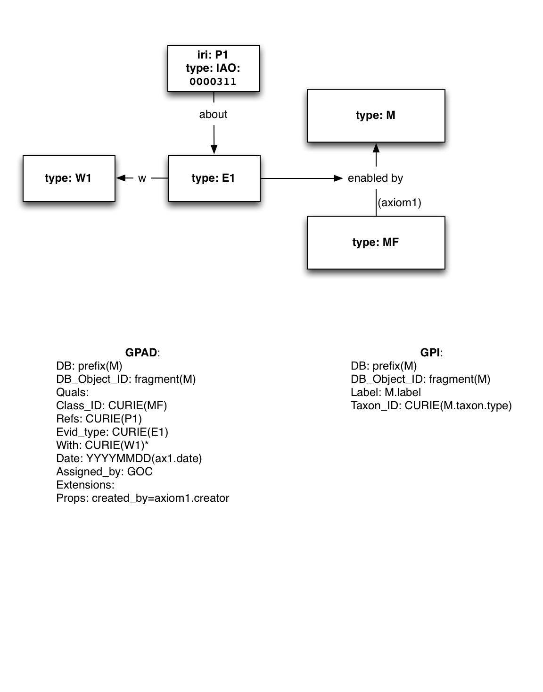

Given a set of gene associations, this procedure will generate LEGO models. The procedure can be reversed for a lossy LEGO->GAF conversion.

The set of associations can be specified by a user query. Includes:

 * grepping a GAF and feeding results
 * selecting all associations for all genes that are involved with some process

## STEP 0 - map GeneAssociation in GAF model

We map every line in a GAF to a structure:

```
GeneAssociation(
 bioentity:<G>
 class:<C>
 ext:<EXT>
 reference:<Ref>
 evidence:<Ev> # TODO
)
```

## STEP 1 - calculate class expression

```
IF <EXT>
 THEN let <CE> = IntersectionOf(<C> <EXT>)
 ELSE let <CE> = <C>
```

(note this may require further transformation, if EXT contains
references to gene products)

TODO: specify behavior for all-individual model

## STEP 2 - map to protein ID

```
IF <G>.IRI startsWith "uniProtKB"
 THEN let <Pr> = <G>
 ELSE let <Pr> = SELECT <Pr> WHERE <Pr> SubClassOf encoded_by some <G> 
```

This could also be done via a gp2protein file.

## STEP 3 - create instance:

```
IF <C> SubClassOf MF THEN:

 NamedIndividual( <generateId>
   Types: 
     <CE>,
     enabled_by SOME <Pr>
   Facts:
     source <Ref>

ELSE IF <C> SubClassOf CC THEN:

 NamedIndividual( <generateId>
   Types: 
     'molecular_function', occurs_in some <CE> 
     enabled_by SOME <Pr>
   Facts:
     source <Ref>

ELSE IF <C> SubClassOf BP THEN:

  # note we create two individuals here

 NamedIndividual( <generateId-X>
   Types: 
     <CE>
   Facts:
     source <Ref>


 NamedIndividual( <generateId>
   Types: 
     'molecular_function'
     enabled_by SOME <Pr>
  Facts:
    part_of <generatedId>,
    source <ref>
```

TODO: specify behavior for all-individual model

## VARIANT OF ABOVE STEP

(optional)

keep a map of Refs -> generated Ids 

when performing `<generateId>`, first check map. If an individual Id has already been generated for this <Ref>, then re-use the existing id from the map.

Note this may result in multiple classification of individuals (MCI). The user can rectify these in Protege.

One variant of this strategy may be to retain the original Id,
generate new Ids for the collapsed aggregate MF individual, and
include evidence links back to the atomic MF individuals.

## Evidence

To be specified. For an example, see




    


